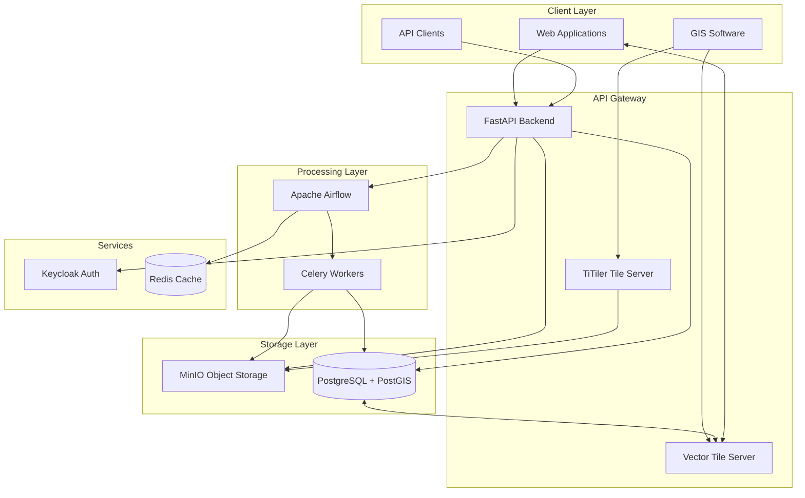
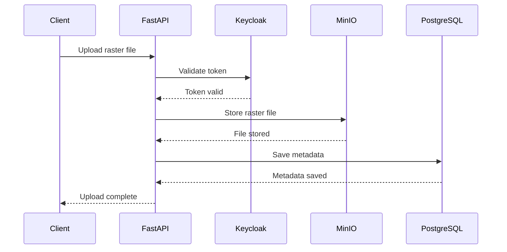
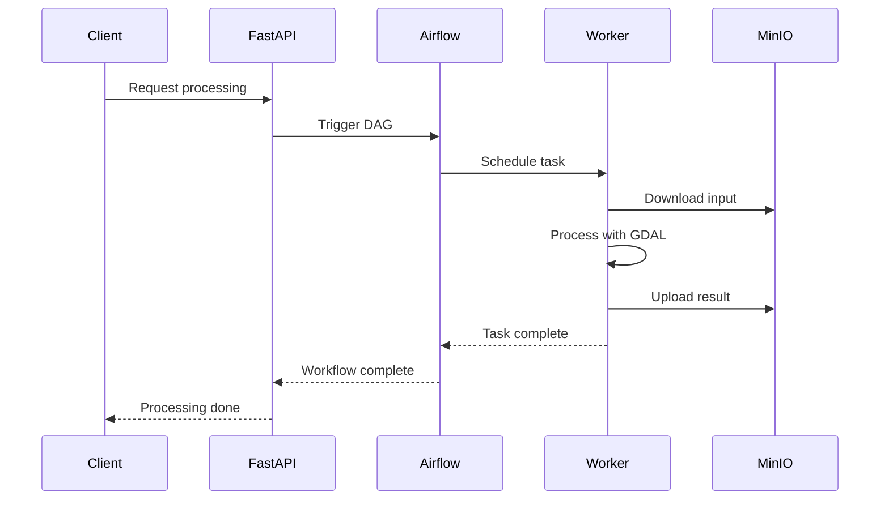

# OpenVista - True Open Source geospatial platform

OpenVista is an Open-source geospatial platform with capabilities of visualisation, management and analysis of multiple data types. 
It is built using modern web technologies and open-source libraries to provide a robust and scalable solution for geospatial data handling.

## Architecture Overview

OpenVista is designed as a modern, cloud-native geospatial processing platform using a microservices architecture. This design ensures scalability, maintainability, and flexibility for various deployment scenarios.

### System Architecture

### Core Components

#### 1. FastAPI Backend
**Purpose**: Main application API and business logic

- **Technology**: FastAPI (Python)
- **Responsibilities**:
  
    * REST API endpoints
    * Authentication integration
    * Data validation
    * Workflow orchestration
    * File upload/download management

#### 2. Apache Airflow
**Purpose**: Workflow orchestration and task scheduling

- **Technology**: Apache Airflow with Celery executor
- **Responsibilities**:
    - Raster processing workflows
    - Terrain analysis pipelines
    - COG optimization tasks
    - Batch processing jobs

#### 3. PostgreSQL + PostGIS
**Purpose**: Primary database for metadata and spatial data

- **Technology**: PostgreSQL with PostGIS extension
- **Responsibilities**:
    - User management
    - Raster metadata storage
    - Processing job tracking
    - Spatial queries and analysis

#### 4. MinIO Object Storage
**Purpose**: Scalable object storage for raster data

- **Technology**: MinIO (S3-compatible)
- **Responsibilities**:
    - Raw raster file storage
    - Processed output storage
    - COG file hosting
    - Temporary processing files

#### 5. Keycloak
**Purpose**: Identity and access management

- **Technology**: Keycloak
- **Responsibilities**:
    - User authentication
    - Authorization policies
    - JWT token management
    - Single sign-on (SSO)

#### 6. TiTiler
**Purpose**: Dynamic raster tile server

- **Technology**: TiTiler (FastAPI-based)
- **Responsibilities**:
    - On-the-fly tile generation
    - Raster visualization
    - Web map integration
    - COG optimization validation

## Data Flow

#### 1. Raster Upload Flow

#### 2. Processing Workflow

## Scalability Considerations

#### Horizontal Scaling

- **Airflow Workers**: Scale processing capacity by adding more worker nodes
- **FastAPI Instances**: Load balance multiple API instances
- **Database**: PostgreSQL read replicas for query scaling
- **Storage**: MinIO distributed mode for high availability

#### Vertical Scaling

- **Memory**: Increase RAM for large raster processing
- **CPU**: More cores for parallel GDAL operations
- **Storage**: SSD storage for faster I/O operations

## Security Architecture

#### Authentication Flow

1. **User Login**: Keycloak handles authentication
2. **Token Generation**: JWT tokens for API access
3. **Token Validation**: FastAPI validates tokens on each request
4. **Authorization**: Role-based access control (RBAC)

#### Data Security

- **Encryption**: TLS/SSL for data in transit
- **Access Control**: User-based file access permissions
- **Audit Logging**: Complete audit trail of operations
- **Network Security**: Container network isolation

## Deployment Patterns

#### Development
- Single-node Docker Compose
- Local file storage
- Minimal resource requirements

#### Production
- Kubernetes orchestration
- Distributed storage
- High availability configuration
- Monitoring and alerting

#### Cloud Native
- Managed database services
- Object storage (S3, GCS, Azure Blob)
- Container orchestration platforms
- Auto-scaling capabilities

## Technology Choices

#### Why FastAPI?
- High performance async framework
- Automatic API documentation
- Type hints and validation
- Modern Python features

#### Why Airflow?
- Mature workflow orchestration
- Rich ecosystem of operators
- Web-based monitoring
- Scalable task execution

#### Why MinIO?
- S3-compatible API
- High performance
- Kubernetes native
- Open source

#### Why PostGIS?
- Mature spatial database
- Rich spatial functions
- ACID compliance
- Strong ecosystem support